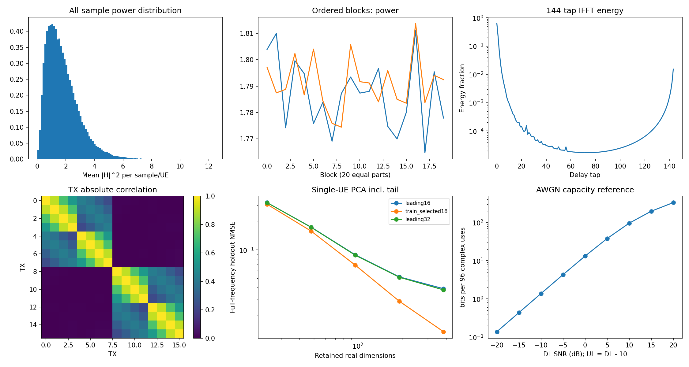

# 6G AI 比赛：重新分析后的建模方案

2026-09-18。本轮交付为**数据审计、三个完整模型、未来训练/评测代码和优化路线**。没有启动训练、没有执行 optimizer.step、没有产生可参赛的训练权重，也没有提交比赛。原始官方模型与训练脚本保持原样。

我的建议是：**先用 v1 校准训练链路，把 v3 的全长度、跨子载波、按位失真优化作为主研究方向；v2 的可变前缀作为对照。最先攻克的是低质量 CSI 反馈与接收端有效信道不确定性，不能只靠增加网络规模。** 三个版本目前都只是待验证候选，不能以未训练结构断言谁会领先。

> **2026-09-18 晚更新**：v1/v3 均已完成训练与线上提交（v1 线上 **61.6069** / 本地 61.15；v3 线上 **62.380** / 本地 62.53，v3 落在本地 95% CI 内、v1 偏 +0.46）。本地配对评测协议与平台基本一致（偏差 ≤0.5），后续选型可直接依赖离线分数。**v4（导频+速率阶梯）已完成 40k 步训练但为负结果：61.99 < v3 的 62.53**，详见[第 9 节](#9-训练与提交记录2026-09-18-起)。

## 1. 先修正会误导方向的旧结论

详细证据见 [规则与旧代码审计](reports/review_notes.md)、[真实数据重算](reports/data_audit.md) 和 [全部统计JSON](reports/data_audit.json)。

| 原有判断 | 本轮核查 | 对模型设计的影响 |
|---|---|---|
| 未编码方案天花板约55.6分 | 原QAM逆映射少了 `/2`；修正后完美CSI的256QAM参考约70.318分 | 旧表不能用来证明编码必然带来十几分收益 |
| 理想编码约67.8是系统上界 | 它只是假设“可靠前缀+剩余随机猜测”的策略参考 | 全源比特的有损重建可能更符合按位计分 |
| 192维PCA约4.8%是单UE压缩下界 | 旧PCA把两UE合并，且没加回截断tap能量；PCA也不是一般模型的信息论下界 | 必须按单UE、独立留出、全频误差、真实反馈噪声比较 |
| 角度近各向同性 | 原FFT变换的是两组轴，而非8阵位轴 | 修正后可研究统计空间先验 |
| 剩余时延能量是fp16噪声 | 尾端4tap占约2.515%；fp16舍入模型只有约4.3e-8 NMSE | 应保留环绕时延能量或频域残差 |
| 永远MU、p10≈52已到物理墙 | 原仿真SNR按SC重抽、p10粒度错误，SU/oracle还有逻辑问题 | 不能提前排除公平性、调度、冗余与失真优化 |

修正后的70.318分仍然使用**完美CSI、理想等效接收、条件期望BER**；它没有上行反馈噪声、有限比特随机性、导频成本与真实控制协议。它是用来发现旧推论错误的设计参照，绝不是预测我们的提交分数。

## 2. 实际数据支持什么

全量检查100,000条；结构分析随机4,000条；PCA仅用其中2,500个原始样本的UE0拟合，在另一批1,000个原始样本上分别检查两UE；参考链路模拟使用1,000条。所有抽样索引已记录。

- **数据质量正常。** shape `[100000,2,2,16,144]`，实虚部分均fp16，未发现NaN/Inf或零能量样本；4,000条抽样中无完全重复。未完成全量重复/场景ID鉴别，因此仍保留group split接口。
- **增益尾部不可忽略。** 样本-UE元素平均功率p1/p10/p50/p90/p99约为 `0.214/0.568/1.556/3.301/5.506`。相同名义SNR下仍有明显信道强弱差异。不能对H随意归一化后当成真实链路；模型内部可以标准化，但要保留幅度条件，物理仿真使用原始H。
- **顺序上未见明显能量漂移。** UE0的20个顺序分块均值约1.765–1.811；相邻样本能量相关约0.0034/0.0059。支持先用随机样本划分，但不能据此证明独立同分布。
- **压缩应保留首尾时延。** 前4tap中位能量95.0%，前16tap96.85%；训练集选择的16个tap为 `0..10,139..143`。同样192实维PCA预算，UE0留出全频NMSE从“仅前16tap”的5.16%降为“训练选择16tap”的2.83%，UE1为4.96%→2.70%。这些都是无反馈噪声的诊断值。
- **空间有统计集中。** 在两组各8个索引的DFT下，第0波束占汇总能量57.9%，池化谱熵0.661；这支持研究空间协方差/固定统计波束。两组是否就是物理双极化阵列尚无元数据证明。
- **粗子带有代价，但不应夸大。** 48SC平均H的NMSE约15.0%；平均H主波束的block增益中位约为逐SC最优的97.4%。12SC/24SC的对应NMSE约2.35%/6.53%。因此细粒度CSI值得做消融，但“15%重建误差”不等于“15%得分损失”。



当前模型使用全部144个时延坐标的可学习投影，加频域分支，避免直接丢掉尾部。下一步可以把训练集PDP/空间协方差做成更强的初始化；本轮没有把PCA拟合结果伪装成已训练神经网络权重。

## 3. 评分与反馈决定了优化目标

当前可执行官方接口是**每用户1152bit，总共2304bit**。指南在总量与单用户公式间复用了Bmax符号，以本地评测代码的明确尺寸为准。

逐用户一次传输的评分可写为：

`score = 50 + 100/1152 × Σ_{j≤B}(正确_j − 0.5)`。

因此，这不是“整包正确才得分”的任务，也没有CRC门槛。应比较保留全部bit但允许误差、重点保护部分bit、减小发送前缀等不同策略。仅优化BLER、仅追求CSI的NMSE、或一味降低码率都可能偏离实际目标。

对于理想均匀二元源，Hamming率失真关系为 `R(D)=1−Hb(D)`。这解释了为什么“全源近似恢复”与“只保证少量bit无误”不同；它提供研究动机，不证明短块MU系统可达到渐近曲线。[Polyanskiy–Wu 信息论教材](https://people.lids.mit.edu/yp/homepage/data/itbook-2022.pdf)

上行反馈实际SNR为下行SNR减10dB。96次复AWGN使用的理想信息容量参考为：

| DL SNR | UL SNR | 96符号的理想容量参考 |
|---:|---:|---:|
| -20 dB | -30 dB | 0.138 bit |
| -10 dB | -20 dB | 1.378 bit |
| 0 dB | -10 dB | 13.20 bit |
| 10 dB | 0 dB | 96.00 bit |
| 20 dB | 10 dB | 332.10 bit |

这里使用单位平均功率的 `96 log2(1+SNR_UL)`，仅为理想容量参照。弱用户的基站瞬时CSI可能几乎不可用；192个实数坐标不意味着192个可靠模拟量。CSI反馈应该随噪声退化到统计先验，而不是持续把噪声当成信道细节。[Gaussian channel 容量与有限长度讨论](https://people.lids.mit.edu/yp/homepage/data/itbook-2022.pdf)

## 4. 三个模型如何实现

三个源文件均可独立作为官方 `modelDesign.py`，无本地包依赖，只依赖PyTorch和标准库。完整说明见 [models/README.md](models/README.md)。

| 版本 | 源文件 | 核心差异 | 参数量 |
|---|---|---|---:|
| v1 | [modelDesign_v1.py](models/modelDesign_v1.py) | 全1152bit，每RE双流16QAM起步，局部可训练调制 | 850,742 |
| v2 | [modelDesign_v2.py](models/modelDesign_v2.py) | 根据自身SNR选择前缀，跨144RE联合编码 | 1,002,463 |
| v3 | [modelDesign_v3.py](models/modelDesign_v3.py) | 全1152bit跨144RE联合编码，面向按位失真 | 1,002,463 |

### 共同部分

1. **Encoder。** 输入本用户H和SNR；分别处理频域和完整IFFT时延域，显式保留log信道幅度；产生96个复数反馈符号并逐样本归一化。
2. **CSI Decoder。** 输入真实含噪反馈和用户SNR。先按 `I/(1+noise_UL)` 做线性MMSE形式的收缩，再由SNR条件化网络恢复全144SC的H。收缩不是非线性MMSE最优性的声明；它先抑制低SNR噪声，让网络学习统计先验。
3. **Precoder。** 每用户2空间流，共4流；由估计H构造RZF，小矩阵求解后加用户共享的学习残差。正则显式包含DL噪声与UL不确定性。两用户交换时结果保持等变，没有固定UE编号嵌入。
4. **Receiver。** 只读 `Y、自己的真实H、公共ctrl、自己的SNR`；局部卷积与全局token mixing共同处理144RE，输出正数代表bit1的logit。它不读取真实W、另一UE的H、基站feedback或共享缓存。
5. **公共5bit。** 编码两用户最小下行SNR的32档量化值，量化范围[-20,20]、bin宽1.25dB，bit顺序为低位在前。它向接收端提供全局链路难度信息，不试图塞入两个独立32档速率。
6. **功率。** CSI反馈按每样本96符号平均能量归一，下行按每样本144SC的全阵平均能量归一，所有波形分量共同占用预算。

**双流是需要验证的选择。** 数据中第二奇异值有显著能量，双流可把每用户8bit/RE拆成两个16QAM流；但低SNR更可能需要单流集中功率。因此本实现用四流做主架构，下一轮应消融单流、动态流数或层功率门控，而非断言双流处处占优。

### v2 的速率契约

双方都理想已知本用户SNR，所以可独立使用相同确定性策略：

| own SNR区间 | 实际发送前缀bit |
|---|---:|
| [-20,-15) | 16 |
| [-15,-10) | 32 |
| [-10,-5) | 72 |
| [-5,0) | 144 |
| [0,5) | 288 |
| [5,10) | 576 |
| [10,15) | 864 |
| [15,20] | 1152 |

这些是用于开始消融的初值，**不是已优化档位**。尤其低SNR前缀很短，即使全对，16bit最多50.694分，因此v2不会被默认当作最优路线。

TX在进入全局编码前就mask掉前缀之外的源bit。训练使用 `forward_full + valid_lengths` 的1152长度张量及mask；官方 `Receiver.forward` 真正截断输出。异长batch不能组成合法的二维变长张量，所以v2正式评测使用batch=1，或按同长度分桶。补零LLR被官方判成1，绝不是弃权。

### v3 的跨RE编码

输入bit先映射到144个token，通过 `144→72→144` 稠密非线性混合及通道MLP，使任意一部分源bit能够影响整个发送block。保留系统化16QAM路径作为初始化支撑，学习路径产生跨RE冗余与失真分配。测试确认改变一个输入bit会在**归一化之前**改变100个以上RE，排除了“只因整块归一化而看起来全局变化”的假象。

端到端物理层学习和JSCC为这种方案提供方法依据，但图像JSCC的收益不能直接移植成均匀随机bit源的收益保证。[O’Shea–Hoydis](https://arxiv.org/abs/1702.00832)、[Bourtsoulatze–Kurka–Gündüz](https://arxiv.org/abs/1809.01733)

## 5. 最需要警惕的模型风险

**有效信道未知是当前首要风险。** 实际W依赖两用户含噪反馈，RX仅凭自己的H不能精确重建W。本轮神经接收机使用整块Y和自身H学习推断；没有额外导频，也没有解析证明能消除所有相位/流关联歧义。在低质量反馈下，这可能使模型训练困难甚至不如更简单的设计。下一轮应优先做：

- 真实含噪反馈 vs 无噪反馈 vs 不用反馈的统计波束对照，区分反馈瓶颈、接收端瓶颈和网络容量瓶颈。
- 为W采用更低维、平滑或已知的结构，降低盲接收机需要估计的自由度。
- 加入带内导频时，把其功率和资源计入X，并明确“哪组流属于本用户”的关联协议；只有导频、没有关联机制仍不完整。
- 训练集空间协方差初始化，或者固定统计波束与学习beam的平滑门控；高噪声时不要由随机反馈驱动极端预编码。
- CSI decoder预训练可以加速，但必须包含真实UL噪声、样本能量归一化；随后以数据链路分数联合优化，不能只追NMSE。

当前三个文件是完整候选实现，不是把这些未验证环节隐藏成已解决的问题。

## 6. 已写好的训练与评测代码

| 文件 | 作用 |
|---|---|
| `research/data.py` | 对ZIP_STORED NPZ直接内存映射，避免完整复制为7.4GB complex64；构造互斥80/10/10划分，支持group ID或顺序划分 |
| `research/link.py` | 重现官方双向噪声、功率归一化、H×X与接口；仅RX读取自身可用信息 |
| `research/objective.py` | 按Bmax归一的中心化BCE，后期混合软bit正确率和底部10%平均分代理 |
| `research/train.py` | AdamW、梯度裁剪、余弦学习率、固定验证、按真实得分选best、记录配置/代码hash/状态 |
| `research/evaluate.py` | 真实hard decision，mean/p10/final、SNR分桶、每UE分数、发送长度分布、按信道行聚类bootstrap区间 |
| `configs/v*.json` | 三版初始训练配置，尚未调参 |
| `tests/test_research.py` | 官方类直接调用、shape/dtype、功率、梯度、无状态旁路、变长评分与序列化检查 |

训练时先用BCE稳定学习，再逐步加少量软分数与尾部代理。CVaR式“底部10%平均分”只是p10的训练替代目标，**并不等于官方p10**，所以最终只按真实hard-score挑模型。CSI NMSE是小权重辅助项，不让不可恢复的弱用户CSI支配损失。

数据先划分原始信道row，同一pair的两UE不能分到不同集合。随机bit、UL/DL噪声在划分后生成。若后续发现场景组/重复样本，应提供 `--groups`，整个组放在同一split。最终test集应在方案与超参数定下来后再使用。

不同模型配对评测必须使用相同的split、seed、样本数、重复次数及batch size；当前随机数消费顺序依赖batch size，所以只固定seed而改变batch size不是严格配对。正式复核使用batch=1，v2的异长情形尤需如此。

### 使用命令

以下均在项目根目录执行。`python` 指安装了依赖的Python环境。CPU验证的本地临时环境为 `/tmp/6g-review-venv/bin/python`；服务器现有环境见原 `remote-server.md`。本轮新模型代码保存在本地。

```bash
# 仅验证，不更新任何参数
python -m unittest discover -s tests -v

# 仅打印配置，不加载数据、不训练
python -m research.train --config configs/v3.json

# 后续使用前生成固定划分；data参数换成实际路径
python -m research.data --data data_train/H_train.npz --out splits/random_seed20260918.npz

# 仅供之后明确决定训练时使用；本轮没有执行
python -m research.train --config configs/v3.json \
  --data data_train/H_train.npz --splits splits/random_seed20260918.npz \
  --out experiments/v3_seed20260918 --run-training

# 后续针对对应已训练权重评测；不要用官方基线权重加载新架构
python -m research.evaluate \
  --design experiments/v3_seed20260918/modelDesign.py \
  --weights experiments/v3_seed20260918/best \
  --data data_train/H_train.npz --splits splits/random_seed20260918.npz \
  --split val --samples 2000 --repeats 3 --batch-size 1 \
  --out experiments/v3_seed20260918/eval_val.json

# 后续打包，使用训练run保存的同版源代码
python package_submit.py --design experiments/v3_seed20260918/modelDesign.py \
  --weights experiments/v3_seed20260918/best --out submit_v3.zip
```

训练入口要求显式 `--run-training`，无此参数仅展示配置。配置里的步数/学习率属于起始计划，不是经过验证的最优参数；checkpoint包含优化器状态，但本轮没有实现自动resume命令。压缩NPZ需要先解出real.npy/imag.npy，并把目录交给data loader；官方当前数据为可直接映射的未压缩NPZ格式。

## 7. 后续实验优先级

| 优先级 | 实验 | 要回答的问题 | 判断依据 |
|---|---|---|---|
| P0 | v1小规模收敛及独立验证 | 正确信号路径能否学会，是否有接收歧义 | BCE下降、hard-score超过猜测、分SNR曲线 |
| P0 | noisy/noiseless/no-feedback对照 | 当前瓶颈是CSI还是RX | 固定信道、bit与DL noise配对比较 |
| P1 | 同数据/预算训练v1、v2、v3 | 本题更适合局部调制、可靠前缀还是全源失真 | 验证mean、p10、总分及置信区间 |
| P1 | 单流/双流、统计beam/学习beam、导频 | 能否改善弱反馈下的可辨识性 | 低SNR尾部与高SNR效率同时观察 |
| P1 | loss：BCE→soft score；尾部权重0/.03/.1 | 能否有效提高p10且不损伤过多均值 | 官方hard分数，不比较不同代理loss大小 |
| P2 | 首尾tap先验、空间协方差初始化、反馈预训练 | 能否更快获得有用CSIT | 分UL SNR的NMSE与最终bit分数 |
| P2 | 12/24/48SC结构、层功率门控、频率功率分配 | 精细频域处理的收益是否覆盖复杂度 | 固定训练预算与真实batch=1推理时间 |
| P2 | v2阈值/长度优化，受控MU/SU/资源分配 | 调度能否提升真实全局p10 | 正确公共控制协议和全数据聚合 |

不要一开始只训最大模型很久，也不要用训练集上随意抽样的官方local eval当作泛化验证。初期只要固定split、固定随机实现、小规模对照，就能比盲目堆叠模块更快定位问题。

## 8. 本轮实际验证结果与边界

- 全量真实数据质量检查及抽样结构/PCA/QAM诊断已经运行完成。
- 本地Python3.11、PyTorch2.8.0、NumPy1.26.4完成6组测试，覆盖三个模型；所有源文件另外按Python3.9语法解析。
- 测试从原 `modelEval.py` 提取实际官方链路类执行，检查其结果与新仿真器一致；不是仅自行断言shape。
- 三个模块都有有限且非零的反向梯度；检查反向前后参数逐值未改变；**optimizer step数为0**。
- 已检查用户交换等变、按样本处理、零信道/极端SNR、v2无尾部bit泄露、变长精确评分、跨RE传播、单文件保存加载。
- 详见 [测试日志](reports/verification_tests.txt) 与 [参数量和CPU耗时](reports/verification.json)。CPU小样本延迟不能替代平台1000秒时限测试；未验证CUDA训练、收敛速度或排行榜效果。

保留原有分析作为历史参考，但涉及上述错误的结论应以本报告及本轮审计为准。

## 9. 训练与提交记录（2026-09-18 起）

### v1 — 首个完成训练与线上提交的版本（run: `experiments/v1_mps_seed20260918`）

- 训练：MPS 30k 步完成（batch 64、lr 3e-4、warmup 3k；loss = BCE + 0.1·soft score + 0.03·tail + 0.01·CSI NMSE）。训练末期仍缓慢上升（27k→30k：61.17→61.22），预算内未完全收敛。
- 离线正式评测（val split、2000 样本 × 3 重复、batch=1、seed 271828）：效率 66.15 / p10 49.48 / **最终 61.15**，聚类 bootstrap 95% CI [60.97, 61.30]；两用户对称（61.11/61.19）。
- **首次线上提交（2026-09-18，submit_v1_mps.zip）：61.6069。** 线上−本地 = +0.46，略高于 CI 上界但幅度小：本地协议与平台基本一致，可作为选型依据；线上额度留给关键节点校准。（早前记录的 61.1069 有误，以平台实测为准。）
- 反馈消融（1000 × 2 重复）：真实含噪 61.07 / 无噪反馈 62.23（**+1.16**）/ 零反馈 51.04（**−10.0**）。结论：CSI 反馈整体价值 ~10 分，但反馈噪声只损失 ~1.2 分——继续优化 CSI 压缩/去噪的收益上限很小；主要差距在接收端有效信道不确定与无速率自适应。低 SNR 桶（[-20,-5)）三种模式效率均 ≈50–53，弱用户在当前设计下未被有效服务；p10 恒为 49.48 是瞎猜地板的直接体现。
- 已知短板：永远发满 1152 bit（prefix_lengths 全为 1152）、无速率自适应。

### v3 — 当前最优，已上线验证（run: `experiments/v3_mps_seed20260918`）

- 40k 步 MPS 训练完成（10:55）。最佳 checkpoint 为最后一步 40000（训练末期仍在缓慢上升，62.50→62.56/4k 步，同 v1 一样未完全收敛）。
- 离线正式评测（与 v1 完全相同的配对协议）：效率 68.12 / p10 49.48 / **最终 62.53**，95% CI [62.33, 62.69]。与 v1 的 61.15 [60.97, 61.30] **CI 完全不重叠，+1.38 为统计显著**。增益全部来自效率分；p10 仍卡 49.48（全 bit 传输的弱用户地板未动）。
- **线上提交（submit_v3_mps.zip）：62.380**，落在本地 CI 内（差 −0.15）。跨 RE 编码增益经平台确认，v3 为当前线上最优提交。

### v2 — 训练完成，不具竞争力（run: `experiments/v2_mps_seed20260918`）

- 40k 步完成（12:0x）。最终：效率 61.94 / p10 49.83 / **58.31**——效率远低于 v1/v3，仅 p10 略好（+0.4）。与“短前缀低 SNR 上限 50.7”的预判一致；且 v2 用的是 v1 式逐 RE 调制骨架，输在中 SNR 段砍速率过狠。留作对照，不消耗线上额度。

### v4 — 训练完成，负结果（run: `experiments/v4_mps_seed20260918`，2026-09-18 晚）

针对 62.5→70+ 差距诊断（见下）设计的两个结构性改动，一次实验同时验证，分桶可归因：

1. **共享导频对**：12/144 个 RE（stride 12，offset 5）上两用户发送相同导频序列对（流内正交、经同一预编码器），接收端用它做每子带等效信道相关特征。依据：v3 高 SNR 桶（[15,20)）效率 89.9 而 256QAM 应在 95+，且无噪反馈消融该桶只 +0.6 → 缺口在接收端有效信道模糊，不在 CSIT。导频与数据共享总功率预算，功率比由可学习 `pilot_scale` 决定；设计上保持用户交换等变（测试验证），跨用户泄漏由 RZF 压制。
2. **低 SNR 速率阶梯**：`[-20,-14)→96, [-14,-9)→192, [-9,-5)→576, [-5,20]→1152` bit。依据：v3 实测 [-20,-5) 桶准确率 50.4–58.8≈地板，评分公式下降速率近乎免费（准确率≥50% 时 μ≥50）；而“扩频=SNR平移”保守模型显示 -5dB 以上降速率是亏的，故高段不动。阶梯为消融起点。
- 预期落点：效率 68→71-74（导频抬中高桶 +3~5）、p10 49.5→51-53（低桶少发多发准），**final ~64-66**。分桶归因：高桶动=导频有效，低桶动=阶梯有效。
- 代码 `models/modelDesign_v4.py`（全测试通过：官方类一致性/梯度/等变/导频RE不变性/变长契约）；配置 `configs/v4.json`（40k 步，同 v3 预算）。
- **实测（40k 步训练完成）：最佳 step 39000，效率 67.24 / p10 49.74 / final 61.99 —— 低于 v3 的 62.53，负结果。** 两个改动叠加后效率反而降 ~0.9：速率阶梯在中 SNR 段（[-9,-5)→576）砍掉的比特多于弱用户拿回的保底分；导频占用功率/RE 未见带来高桶补偿；p10 仅 +0.26，远低于预期。后续应把两个改动拆开消融（v4a 仅速率阶梯、v4b 仅导频），或直接在 v3 骨架上做更温和的低 SNR 功率倾斜而非砍速率。

### 与第一名的差距诊断（2026-09-18，排行榜 70+）

按 p10 物理上限 ~55 反推，第一名效率约 76-78，超过“完美CSI+理想接收+满速率”参照（70.3）6-8 分 → 他们必然做了速率/冗余自适应且解决了接收端等效信道问题。我们的 8 分缺口：接收端等效信道模糊（高桶 84→95 空间，估 3-4 分）、无速率自适应（低桶全浪费，p10 地板，估 3-4 分）、CSI 反馈噪声（实测上限 1.16，不值得投入）、训练未收敛（~0.3）。v4 攻前两项。

### 提交台账

| 日期 | 次序 | 包 | 本地分 | 线上分 | 差值 |
|---|---|---|---|---|---|
| 2026-09-18 | 1 | submit_v1_mps.zip（v1 best@30k） | 61.15 | **61.6069** | +0.46 |
| 2026-09-18 | 2 | submit_v3_mps.zip（v3 best@40k） | 62.53 | **62.380** | −0.15 |
